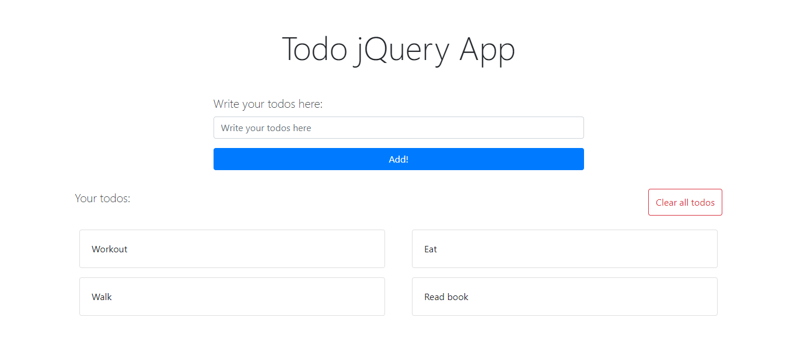
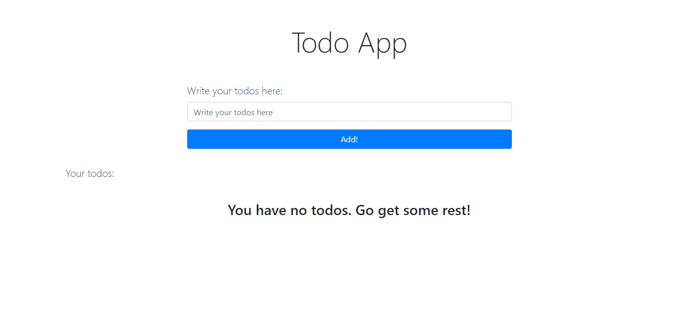
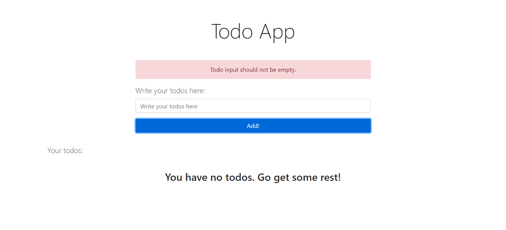
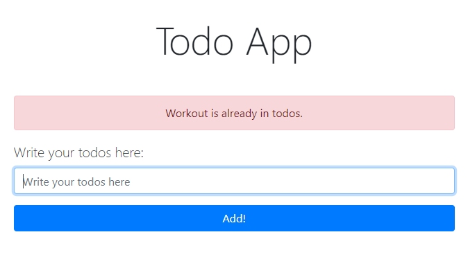

# Todo App

- This application is made with HTML, CSS, Bootstrap, and jQuery. It is more focused on **jQuery**. Also it have some explanation on script.js using comment.

## Here are the things that you can do here:
  1. **Add todo** - Add that through input. You can also submit a todo by hitting enter on your keyboard. There are rules for creating todos, first is it should not be empty and last is it should not be repeated.
  2. **Clear all todos** - You can do this by hitting the Del (Delete) on keyboard or click the Clear All Todos button.

## With and Without Todo
  ##### With
  
  ##### Without
  

## Adding Empty and Repeated Todo
  ##### Empty
  
  ##### Repeated
  

## Quick Start
  1. On terminal/CMD do the following command:
      ```
        git clone https://github.com/clediscover/Todo-App.git
      ``` 
  2. Go to the directory, where you've cloned, then open the "index.html".
  3. It's done!

# Todo App
[](https://github.com/clediscover/Todo-App/issues)
[](https://github.com/clediscover/Todo-App/network)
[](https://github.com/clediscover/Todo-App/stargazers)
[](https://github.com/clediscover/Todo-App/blob/master/LICENSE.md)

[](https://clediscover.xyz)